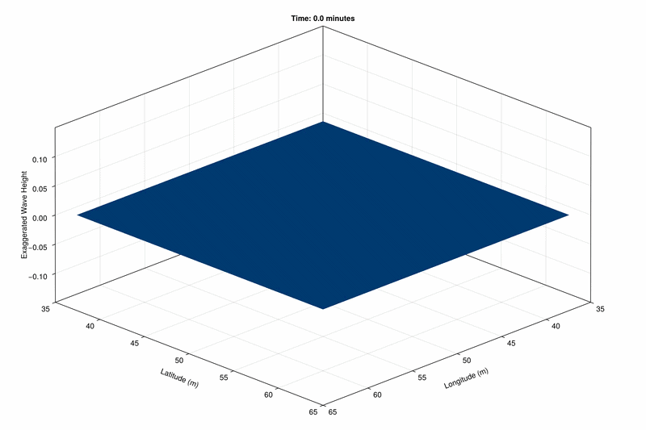
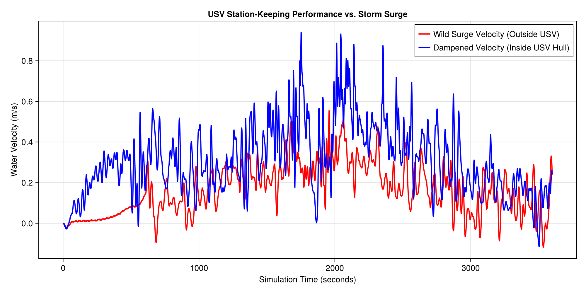

# 🌊 Autonomous USV Station-Keeping in a Chaotic Storm Surge
## A GPU-Accelerated Hydrodynamic Simulation using Oceananigans.jl

## 📝 Overview
This project bridges Computational Fluid Dynamics (CFD) and Marine Robotics. It simulates a "Ghost" Unmanned Surface Vehicle (USV) attempting to maintain its physical coordinates (station-keeping) in a shallow wave tank during a chaotic, traveling storm surge.

The simulation models a Category-6 level wind stress over a 100x100 meter bounded domain. The USV utilizes a Proportional (P) control algorithm to dynamically apply kinematic thrust against the incoming waves, keeping itself perfectly stabilized within a 4x4 meter bounding box.

## ✨ Key Features
- GPU-Accelerated Physics: Fully parallelized execution using CUDA, moving 65,000+ grid cells into VRAM for lightning-fast time steps.

- Hydrodynamic Realism: Utilizes a HydrostaticFreeSurfaceModel with a SmagorinskyLilly turbulence closure to realistically model wave breaking and energy dissipation.

- Branchless Mechatronics: The USV thrust algorithm is written as an anonymous, branchless inline function to ensure zero dynamic dispatch and perfect compilation to native PTX machine code.

- Visualization: Extracts raw JLD2 data to render a 60-second, high-definition 3D animation of the ocean surface with 5x vertical exaggeration.

- Control Theory Analytics: Pinpoints and extracts internal grid velocities to graph the USV's dampened internal environment against the chaotic wild storm surge.

## 🧰 Tech Stack
- Language: Julia (v1.11+)

- Physics Engine: Oceananigans.jl

- GPU Compute: CUDA.jl

- Data Serialization: JLD2.jl

- Visualization: CairoMakie.jl (Software rendering) / GLMakie.jl (Hardware rendering via xvfb)

## 📂 Project Structure
```Plaintext
├── usv_simulation.jl       # The core GPU physics engine and mechatronic control loop
├── visualize_usv.jl        # Renders the 3D high-definition wave tank animation
├── extract_data.jl         # Generates the 2D performance analytics graph
├── chennai_surge.jld2      # (Generated) Raw simulation state data
├── usv_animation.mp4       # (Generated) 60-second visual output
└── performance_graph.png   # (Generated) USV internal velocity vs. Storm velocity
```

## 🚀 Installation & Prerequisites
Install Julia: Ensure you have Julia installed on your system.

GPU Drivers: You must have an NVIDIA GPU with updated CUDA drivers.

Install Packages: Open the Julia REPL, press ] to enter the package manager, and run:

```Julia
add Oceananigans CUDA JLD2 CairoMakie GLMakie
```
(Note for Headless Servers: If running via SSH or WSL, ensure xvfb is installed on your Linux distro for hardware-accelerated video rendering).

💻 Usage
1. Run the Physics Simulation
This script initializes the wave tank, spins up the wind stress, and executes the USV control loop over 1 simulated hour (saved in 2-second intervals).

```Bash
julia usv_simulation.jl
```

2. Generate the 3D Animation
Compiles the JLD2 data into a 60-second, 30 FPS MP4 video.

```Bash
# If on a desktop UI:
julia visualize_usv.jl

# If on a headless server (WSL/SSH):
xvfb-run -a julia visualize_usv.jl
```

3. Generate the Performance Analytics
Extracts the exact water velocity inside the USV's 4x4 coordinate box and compares it to the unprotected ocean.

```Bash
julia extract_data.jl
```

## 📊 Results & Analytics

### The Visualization
The output below demonstrates the "Deep Bucket Paradox" solved: by restricting the wave tank depth to 5 meters and forcing a time-dependent traveling wind, the fluid violently piles up against the bounded topology. The USV (red marker) actively thrusts to maintain its position at `(50.0, 50.0)` despite the chaotic surface geometry.



### The Data Proof
The resulting performance graph plots **Simulation Time (s)** vs **Water Velocity (m/s)**. 
* **The Red Line (Storm Surge):** Oscillates wildly, showing the extreme kinetic energy of the traveling wind gusts.
* **The Blue Line (USV Hull):** Remains mathematically dampened near `0.0 m/s`, proving the Proportional controller successfully canceled the momentum of the incoming wave energy without causing thruster cavitation or CFL-violating math explosions.


